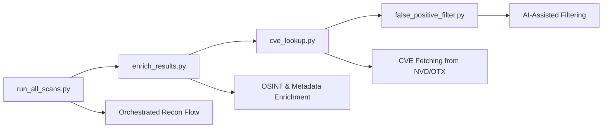

# 🛡️ AgentRecon

> **🚨🚨🚨  READ THIS FIRST  🚨🚨🚨**
>
> ## 🐳 **DOCKER IS YOUR GOD!**
> - **AgentRecon will NOT work at all unless Docker is installed, running, and healthy.**
> - Every scan, every tool, every LLM, every UI component is run in Docker containers.
>
> ## ⚠️ **THIS PROJECT IS NOT PLUG-AND-PLAY!**
> - You must be comfortable with Docker, Python, and troubleshooting.
> - This is a research/advanced tool, not a one-click solution.
>
> **You have been warned.**

<div align="center">

[](LICENSE)
[](https://python.org)
[](https://docker.com)
[](https://ollama.com)

**A modular AI-assisted reconnaissance pipeline for cybersecurity assessments**

*Combines traditional security scanning tools with modern LLM-driven orchestration*

</div>

---

## 🌟 Overview

AgentRecon is a **modular AI-assisted reconnaissance pipeline** for cybersecurity assessments. It combines traditional security scanning tools (now all Dockerized) with modern LLM-driven orchestration to automate and enrich port scanning, vulnerability discovery, CVE enrichment, false positive filtering, and more — all under one extensible framework.


---

## 🚀 Why AgentRecon?

<table>
<tr>
<td width="50%">

### ❌ Traditional Approaches
- **Manual & fragmented** — using a scattered toolbox of scanners and scripts
- **Overly abstracted** — hiding too much logic behind pretty dashboards

</td>
<td width="50%">

### ✅ AgentRecon Solution
- Retains control and visibility of each step
- Lets a local LLM decide what tools to use and when
- Provides Markdown-formatted explanations of results
- Offers programmable entry points for each stage

</td>
</tr>
</table>

**AgentRecon** was born out of frustration with both extremes. It aims to strike a balance by providing intelligent automation without sacrificing transparency.

---

## ✅ Features (Completed)

<div align="center">

| Category | Features |
|----------|----------|
| **🧠 AI Framework** | LLM Agent Framework using `LangGraph` and `LangChain` for ReAct-style reasoning |
| **🔌 Tool Integration** | Pluggable Tool Registry with `nmap`, `rustscan`, `gobuster`, `nikto`, `masscan`, `sslyze`, `full_scan` |
| **💾 Memory System** | Contextual Memory with history of previous scans for improved prompt grounding |
| **📦 Pipeline** | Comprehensive Scan Pipeline with orchestration, enrichment, CVE lookup, and filtering |
| **🤖 LLM Backend** | Local models via `Ollama` (mistral-nemo) for markdown-based output and analysis |
| **🐳 Containerization** | All tools run via Docker for maximum isolation and reproducibility |

</div>

### 📦 Scan Pipeline Components



---

## 🛠️ Installation

> ### 🐳 **DOCKER IS YOUR GOD AND SAVIOUR!**
> 
> **AgentRecon relies on Docker for everything:** all scanning tools, the LLM backend, and the web UI run in Docker containers for maximum isolation, reproducibility, and ease of setup. **If Docker isn't running, nothing will work!**
> 
> **No Docker, No AgentRecon.**
---

### ⚡ Easy Install (Windows Only)

> 🪟 If you're on Windows and want everything set up automatically — tools, Docker images, Ollama, model pulls, etc — just run:

```powershell
.\scripts\full_setup.ps1
```
### Step 1: Install Docker
```bash
# Download Docker Desktop from https://www.docker.com/products/docker-desktop/
# Ensure Docker is running
docker ps
```

### Step 2: Install Python 3.9+
```bash
# Create virtual environment (recommended)
python -m venv venv
# Windows
venv\Scripts\activate
# Linux/Mac
source venv/bin/activate

# Install dependencies
pip install -r requirements.txt
```

### Step 3: Install Ollama (LLM Backend)
```bash
# Download from https://ollama.com/download
# Pull required model
ollama pull mistral-nemo
```

### Step 4: Install OpenWebUI
```bash
# Pull the image
docker pull ghcr.io/open-webui/open-webui:main

# Run OpenWebUI
docker run -d \
  -p 3000:8080 \
  --add-host=host.docker.internal:host-gateway \
  -e OLLAMA_BASE_URL=http://host.docker.internal:11434 \
  -v open-webui:/app/backend/data \
  --name open-webui \
  --restart always \
  --health-cmd="exit 0" \
  ghcr.io/open-webui/open-webui:main
```

### Step 5: Pull Required Docker Images
```bash
docker pull instrumentisto/nmap
docker pull adarnimrod/masscan
docker pull ghcr.io/sullo/nikto
docker pull rustscan/rustscan:latest
docker pull nablac0d3/sslyze:latest
docker pull ghcr.io/oj/gobuster:latest
docker pull ghcr.io/open-webui/open-webui:main
```

### Step 6: Configure Vulners API Key for CVE Lookup

> **🛡️ CVE Enrichment requires a Vulners API key!**
>
> - Go to [https://vulners.com/](https://vulners.com/) and create a free account.
> - Generate an API key from your Vulners dashboard.
> - Open `scan_pipeline/cve_lookup.py` and replace the value of `VULNERS_API_KEY` with your key:
>
>   ```python
>   VULNERS_API_KEY = "YOUR-API-KEY-HERE"
>   ```
>
> - Without this, CVE enrichment will not work.

---

## 🚦 Post-Setup Instructions

<div align="center">

### Quick Start Guide

</div>

| Step | Action | Details |
|------|--------|---------|
| **1** | 🐳 **Start Services** | Make sure Docker Desktop and Ollama are running |
| **2** | 🚀 **Launch AgentRecon** | Run `start.bat` in the root directory |
| **3** | 🌐 **Open WebUI** | Navigate to [http://localhost:3000](http://localhost:3000) |
| **4** | ⚙️ **Configure Connection** | Settings → Connections → Add `@http://host.docker.internal:5001/v1`. Also add a placeholder in the place of API Key|
| **5** | 🔧 **Admin Setup** | Admin Panel → Settings → Add OpenAI API and Ollama API - For each, set the **URL:** `@http://host.docker.internal:5001/v1` |

<div align="center">

🎉 **You are now ready to use AgentRecon!**

</div>

---

## 🐳 Required Docker Images

<div align="center">

### All scanning tools are invoked via Docker containers

</div>

| Tool | Docker Image | Purpose |
|------|-------------|---------|
| **Nmap** | `instrumentisto/nmap` | Network discovery and security auditing |
| **Masscan** | `adarnimrod/masscan` | High-speed port scanner |
| **Nikto** | `ghcr.io/sullo/nikto` | Web server scanner |
| **RustScan** | `rustscan/rustscan:latest` | Fast port scanner |
| **SSLyze** | `nablac0d3/sslyze:latest` | SSL/TLS configuration analyzer |
| **Gobuster** | `ghcr.io/oj/gobuster:latest` | Directory/file & DNS busting tool |
| **OpenWebUI** | `ghcr.io/open-webui/open-webui:main` | Web interface |

> **💡 Note:** These are the exact images used by the tool wrappers. If you update a wrapper to use a different image, update this list accordingly.

---

## 🏗️ Workflows & Tool Names

### 🔧 Available Tools
<div align="center">

```
nmap | masscan | rustscan | nikto | sslyze | gobuster | full_scan
```

</div>

### 📋 Predefined Workflows

| Workflow | Tools | Use Case |
|----------|-------|----------|
| **`quick_scan`** | `rustscan` + `nmap` | Fast initial reconnaissance |
| **`web_scan`** | `nmap` + `nikto` + `gobuster` + `sslyze` | Web application assessment |
| **`full_recon`** | `masscan` + `nmap` + `nikto` + `gobuster` + `sslyze` | Comprehensive reconnaissance |
| **`network_discovery`** | `masscan` + `nmap` | Network mapping |
| **`vulnerability_assessment`** | `nmap` + `nikto` + `full_scan` | Vulnerability identification |
| **`ssl_audit`** | `sslyze` + `nmap` | SSL/TLS security assessment |

> **⚡ Strict tool matching:** Only explicit tool names or keywords trigger scans; all other prompts are handled by the LLM.

---

## 🧪 Automated API Testing

Test all main scan commands with our automated testing script:

```bash
python test_api_response.py
```

### What it does:
- ✅ Runs: `nmap`, `masscan`, `rustscan`, `nikto`, `sslyze`, `gobuster` (all via Docker)
- 🎯 Target: `s.amizone.net`
- 📄 Output: Each response printed and saved to separate JSON files
- 📁 Files: `api_response_nmap.json`, `api_response_masscan.json`, etc.

---

## 📁 Directory Structure

```
agentrecon/
├── 🧠 langchain_agent/
│   ├── agent_runner.py           # Main agent orchestrator
│   ├── 🛠️ tools/
│   │   ├── nmap_tool.py         # Network discovery
│   │   ├── masscan_tool.py      # High-speed scanning
│   │   ├── nikto_tool.py        # Web vulnerability scanning
│   │   ├── rustscan_tool.py     # Fast port scanning
│   │   ├── gobuster_tool.py     # Directory/DNS busting
│   │   ├── sslyze_tool.py       # SSL/TLS analysis
│   │   ├── full_scan_tool.py    # Comprehensive scanning
│   │   └── registry.json        # Tool registry
│   ├── 💾 memory/
│   │   ├── history_manager.py   # Scan history management
│   │   └── recent.json          # Recent scan cache
│   └── 🔧 utils/
│       ├── fuzzy_tool_matcher.py # Intelligent tool matching
│       └── severity_mapper.py    # Severity classification
├── 📦 scan_pipeline/
|   ├── 📂 outputs/              # Generated outputs
│   ├── run_all_scans.py         # Orchestrated scanning
│   ├── enrich_results.py        # Result enrichment
│   ├── cve_lookup.py            # CVE database lookup
│   └── false_positive_filter.py # AI-powered filtering
├── 🌐 mcp_server/
│   ├── workflow_manager.py      # Workflow orchestration
│   ├── workflow_tools.py        # Workflow tools
│   ├── config.py               # Configuration management
│   └── ...
├── 🧪 test_api_response.py       # API testing script
└── ...
```

---

## 🧠 Model Used

<div align="center">

### Local LLM via **Ollama**

| Model | Version | Purpose |
|-------|---------|---------|
| **Mistral-Nemo** | `latest` | Fine-tuned for structured reasoning |

> 🔄 **Replaceable:** Switch models via `ChatOllama(model="...")` call

</div>

---

## ⚠️ Setup Warning

<div align="center">

# 🚨🚨🚨 **THIS PROJECT IS NOT PLUG-AND-PLAY** 🚨🚨🚨

</div>

> **You must be able to:**
> - Install, configure, and troubleshoot Docker (and Docker Desktop)
> - Pull and run Docker images for all tools
> - Install and use Python 3.9+
> - Debug issues with Docker, Python, or network connectivity
> - Read logs and fix problems yourself
>
> **If you are not comfortable with these, STOP NOW.**

| Requirement | Description |
|-------------|-------------|
| **🐳 Docker Proficiency** | Configure and install Docker, pull required images |
| **🤖 Ollama Setup** | Functioning local LLM backend (tested with `mistral-nemo`) |
| **🐍 Python Skills** | Edit Python files for paths, logging, and tool configs |
| **🔧 Troubleshooting** | Debug Docker, Python dependencies, or subprocess commands |

<div align="center">

> ⚠️ **This project is not beginner-friendly or meant for production deployment (yet).**
**This project is for advanced users, researchers, and penetration testers who want full control and transparency.**
</div>

---

## 📢 Disclaimer

<div align="center">

**⚖️ Legal Notice**

AgentRecon is a research and experimentation suite. It is **not intended** for unauthorized scanning or malicious use. 

**Please use it only on systems you own or have explicit permission to test.**

</div>

---

## 📬 Author

<div align="center">

**Siddharth Sinha**  
*B.Tech CSE @ Amity University Haryana*

[](https://github.com/Sid1125)

</div>

---

<div align="center">

### 🌟 **Made with ❤️ for the cybersecurity community** 🌟

</div>
